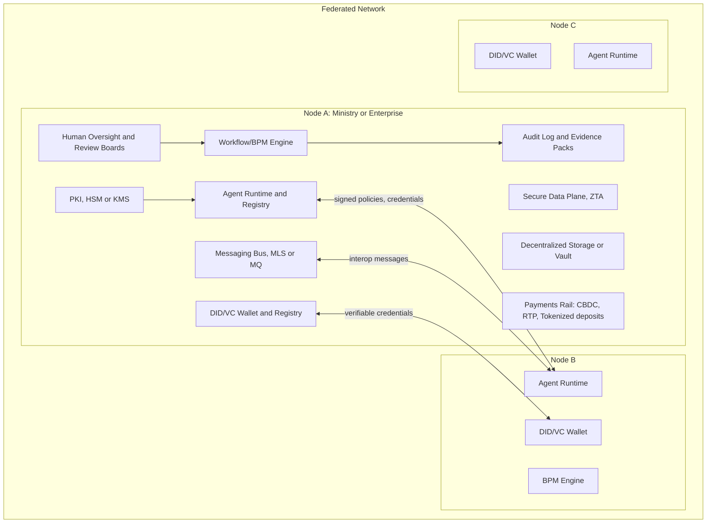
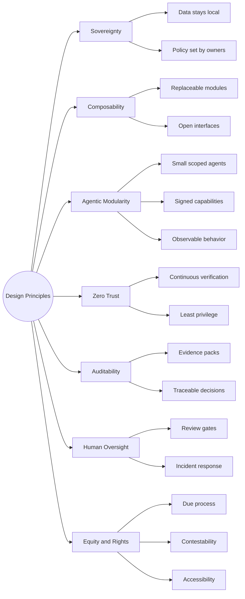
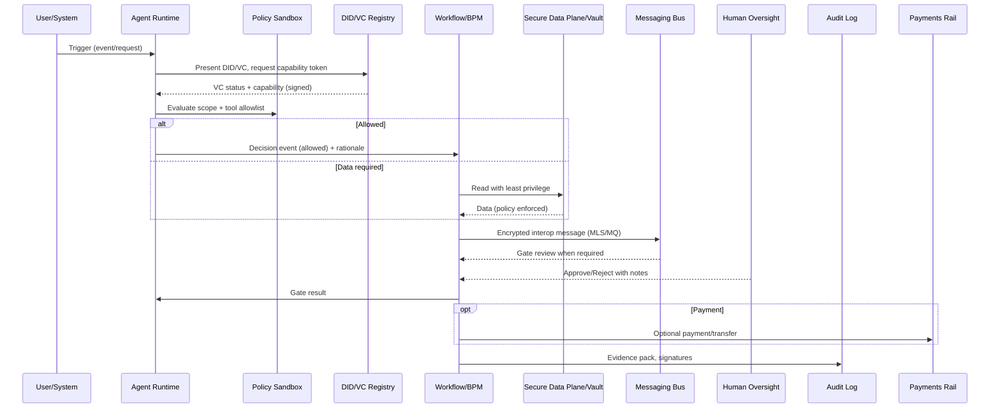
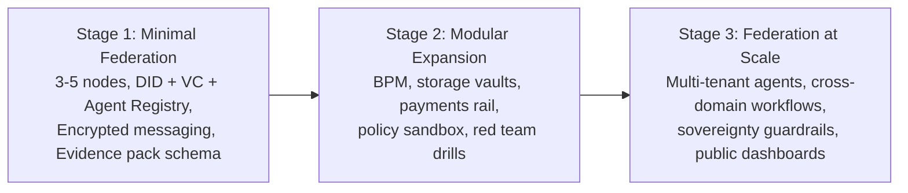
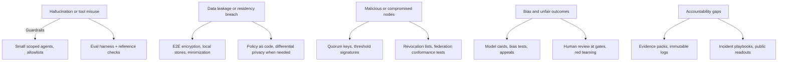
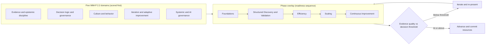
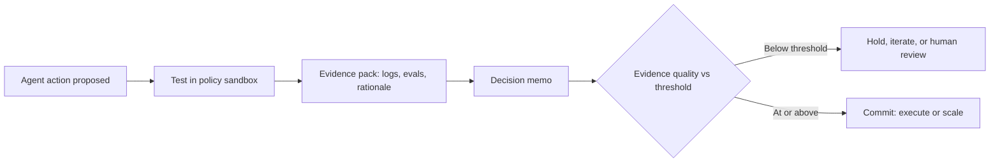

## A blueprint for next-generation decentralized governance

### Abstract

Autonomous software agents are moving from demonstrations into the operational core of governments and enterprises, and they are doing so faster than most institutions can govern them. This paper argues that the binding constraint is not model capability but *decision quality*: the discipline with which an institution decides what to automate, on what evidence, and under whose accountability. We set out a federated, agent-based reference architecture that keeps data and policy local to each participating node while sharing open protocols for identity, messaging, and audit. The architecture rests on established standards (W3C decentralized identifiers and verifiable credentials, NIST's Zero Trust and AI Risk Management guidance, and ISO/IEC 42001), and it anticipates the obligations of the EU AI Act. Its distinguishing move is to bind every consequential action, whether an innovation milestone or a single agent call, to the same evidence-to-decision loop. We then show how that loop is operationalized through Doulab's domains-first [Innovation Maturity Model Program (IMM-P®)](/services/innovation-maturity) 2.2 and the [MicroCanvas® Framework (MCF)](/docs/research-resources/microcanvas) 2.2, so that autonomy expands only as far as verified readiness allows. The result is a delivery model for credible autonomy under human oversight, suitable for regulated and multi-stakeholder settings.

---

### List of figures

- [Figure 1. Federated network architecture](#fig1)
- [Figure 2. Design principles](#fig2)
- [Figure 3. End-to-end interaction sequence](#fig3)
- [Figure 4. Implementation stages](#fig4)
- [Figure 5. Risks and safeguards](#fig5)
- [Figure 6. IMM-P® domains and phase overlay](#fig6)
- [Figure 7. The evidence gate applied to an agent action](#fig7)

---

### 1. Why the centralized model runs out of road

Digital infrastructure has scaled faster than our capacity to govern it, and agentic AI widens the gap. A single mistaken assumption, encoded once and executed at machine speed across a platform, no longer produces a local error; it produces a systemic one. The instinctive response, to consolidate everything behind one vendor or one central authority so it can be watched, concentrates precisely the power, data, and failure modes that make the consequences severe. Lock-in, opaque decision-making, and cross-border data transfer become structural rather than incidental.

A federated design inverts the default. Institutions retain their own data and set their own policy, but they interoperate through open, auditable interfaces and a shared protocol for trust. Coordination happens at the level of verifiable claims and signed messages, not shared servers. The aim is a shift from platform dependence toward sovereign, standards-based interoperation, with accountability that can be traced to a named owner at every step. None of this is free: federation trades some convenience and latency for control and legitimacy. The wager of this paper is that, in regulated and high-trust contexts, that trade is the correct one, and that it only pays off if the governance discipline is as engineered as the cryptography.

---

### 2. The architecture in one view

The unit of the system is the *node*: a ministry, agency, state-owned enterprise, municipality, or firm that participates on shared protocols while keeping its data and policy under local control. Each node runs small, task-specific agents whose capabilities are signed, whose scopes are explicit, and whose behavior is observable. Nodes exchange verifiable credentials and encrypted messages rather than raw data, so collaboration never requires surrendering custody.

##### Figure 1. Federated network architecture {#fig1}

:::info Notice that nodes exchange *credentials and messages*, never a shared database

:::

Seven capabilities recur in every mature node, and they are best understood by what they guarantee rather than by the products that implement them. Identity and trust rest on decentralized identifier (DID) registries and verifiable credentials (W3C, 2022, 2024) for people, organizations, and agents, with X.509 certificates for infrastructure and private keys held in a hardware security module or cloud key-management service. The agent layer keeps models small and scoped, each with an explicit tool allowlist, a signed manifest, and a runbook, so that capability is granted deliberately rather than assumed. Messaging is an encrypted bus for interoperation, using a queue or group-encryption scheme such as Messaging Layer Security. Workflows, expressed as business-process rules, bind decisions to evidence and route them through review gates. The data plane enforces Zero Trust access and turns to confidential compute where the sensitivity of the data warrants it. A payments rail (a central bank digital currency pilot, an instant-payment scheme, or tokenized deposits) remains an optional module behind strict compliance. Oversight, finally, is not a feature bolted on at the end but a standing capability: human review, incident response, red-teaming, and public logs where disclosure is appropriate.

---

### 3. Design principles

The architecture is opinionated in a single direction: prefer small, testable, replaceable parts over monoliths, because auditability and reversibility are properties of composition, not of scale. Sovereignty means data stays local and policy is set by its owner. Composability means modules can be swapped without renegotiating the whole. Agentic modularity means each agent is small, scoped, signed, and observable. Zero Trust means continuous verification and least privilege as defaults rather than exceptions. Auditability means every decision leaves an evidence trail. Human oversight means review gates and incident response are always reachable. And equity means due process, contestability, and accessibility are treated as design requirements, not afterthoughts.

##### Figure 2. Design principles {#fig2}

:::tip Notice that every branch reduces to *keeping options open and decisions traceable*

:::

Taken together, these commitments are what prevent the failure modes that recur in centralized deployments: vendor lock-in, opaque decisions, one-size-fits-all models, and the quiet accumulation of unsafe data gravity in a single place.

---

### 4. Reference modules

Where Section 2 named the capabilities, this section states what each module must do to earn its place in the trust chain.

**Identity and access.** DIDs and verifiable credentials establish who, or what, is acting, for people, organizations, and agents alike. Phishing-resistant authentication through FIDO and WebAuthn (W3C, 2021) protects the human entry points, and assurance is mapped to the levels of NIST SP 800-63 (NIST, 2017) so that the strength of proof matches the sensitivity of the action.

**PKI and trust.** X.509 certificates anchor infrastructure identity, threshold signatures (IETF, 2023) place high-consequence controls behind a quorum rather than a single key, and signed agent manifests make an agent's declared capabilities verifiable before it runs.

**Agent runtime.** Agents execute inside a policy sandbox with capability tokens and tool allowlists. Prompts are reproducible and datasets are documented, so that an action can be replayed and explained after the fact rather than merely trusted in the moment.

**Messaging and interoperation.** Nodes exchange evidence, decisions, and events through shared schemas over confidential channels, which is what lets them collaborate without a common server.

**Workflow and BPM.** Stage gates, roles, and escalation paths orchestrate the work, and every gate writes an immutable entry to the evidence log.

**Ledger or log.** An append-only audit record carries retention rules, a privacy budget, and its own access logs, so that the act of auditing is itself auditable.

**Payments.** When value must move, a CBDC pilot, instant-payment rail, or tokenized-deposit scheme does so under explicit compliance controls, and only when a workflow gate has authorized it.

**Observability.** Model cards, evaluation traces, drift monitors, data lineage, and kill switches make the system's behavior legible to the people accountable for it.

These modules are not independent silos; they form a single loop. Identity issues and verifies the credentials that the agent runtime and workflow gates consume. The agent runtime signs its actions and emits events to messaging, which forwards them to other nodes. Workflow consumes those events and writes evidence packs to the audit log, while the secure data plane enforces the access decisions that workflow and policy hand down. Payments, when they occur, are triggered only after gates pass, and human oversight can approve, deny, or demand more evidence at any defined checkpoint. The sequence below traces one such action end to end.

##### Figure 3. End-to-end interaction sequence {#fig3}

:::info Notice that no action reaches the data plane or a payment rail before a credential and a gate have cleared it

:::

---

### 5. Where it applies

The design is most valuable where accountability and data custody cannot be relaxed. In the public sector, benefits and permits can be issued against verifiable proofs while the underlying records stay local and appeals remain transparent; budget-planning assistants can keep audit trails and participation records; and case management can cross ministries through scoped, credential-gated data sharing rather than a shared database. In enterprises, cross-border compliance checks can rely on verifiable proofs instead of bulk data transfer, contract-negotiation agents can operate with human approval at each gate, and a supply-chain risk radar can pool signals and provenance across firms without exposing anyone's raw data. And in multi-stakeholder ecosystems, whether a municipality coordinating with a national agency or a public-private pilot, collaboration proceeds through open playbooks, shared evidence, and readouts, again without a common server. The through-line is constant: parties that do not fully trust one another can still act together when trust is carried by verifiable claims rather than by a central intermediary.

---

### 6. Implementation pathway

The pathway is deliberately incremental, because a federation earns the right to scale by proving that its evidence discipline holds at small size first.

##### Figure 4. Implementation stages {#fig4}

:::info Notice that each stage adds capability only after the prior stage's evidence discipline is proven

:::

The first stage stands up the trust spine and nothing more: DIDs and verifiable credentials, issued roles, WebAuthn for administrators, a defined evidence-pack schema, and the first registered agents. On that base, one or two cross-organization workflows (permit issuance, say, or case referral) are piloted end to end. The second stage adds the machinery that repeatability requires: a BPM engine, storage vaults, and, where relevant, a payments rail, each hardened through privacy reviews, security testing, and red-team exercises, with model and dataset cards published and rollback procedures defined before they are needed. Only in the third stage does the federation broaden to many nodes, governed now by shared catalogs, conformance tests, and continuous controls, with dashboards on service levels, appeals, and incidents that the public can read where disclosure is appropriate. The order is the point: capability follows proof, never the reverse.

---

### 7. Risks and safeguards

No serious autonomy program survives contact with production unless its risks are named in advance and each is paired with a concrete control. Five risk families dominate. Hallucination and tool misuse are contained by keeping agents small and scoped behind allowlists and by running an evaluation harness with reference checks before actions commit. Data leakage and residency breaches are addressed through end-to-end encryption, local stores, minimization, and policy-as-code, with differential privacy where analytics demand it. Malicious or compromised nodes are held in check by quorum keys and threshold signatures, revocation lists, and federation conformance tests. Bias and unfair outcomes are surfaced by model cards, bias testing, and human review at the gates, and are made contestable through appeals. And accountability gaps are closed by evidence packs, immutable logs, incident playbooks, and public readouts.

##### Figure 5. Risks and safeguards {#fig5}

:::warning Notice every risk on the left is answered by at least two independent controls on the right

:::

Underneath these specific pairings sits a smaller set of operating practices that make them coherent. Controls are mapped to the four functions of the NIST AI Risk Management Framework (govern, map, measure, manage) (NIST, 2023) so that no risk is merely asserted. ISO/IEC 42001 (ISO/IEC, 2023) embeds that mapping into a management system rather than a one-off review, turning gate reviews into recurring management reviews. A Zero Trust posture keeps continuous verification, least privilege, and segmentation as defaults. Legal readiness means classifying each system under the EU AI Act's risk tiers (European Commission, 2024) and maintaining the technical documentation and post-market monitoring those tiers require. And public trust is treated as an outcome to be engineered: contestation is enabled, summaries are published, and feedback loops are run rather than promised.

---

### 8. Standards and policy alignment

The design leans deliberately on published norms rather than proprietary invention. Portable trust comes from the W3C's DID Core and Verifiable Credentials Data Model 2.0 (W3C, 2022, 2024), which reduce lock-in and simplify cross-border verification. Identity proofing and authentication are aligned to risk through NIST SP 800-63 (NIST, 2017), and the security posture follows SP 800-207's definition of Zero Trust (NIST, 2020), paired with WebAuthn (W3C, 2021) and threshold signatures (IETF, 2023) for quorum control. ISO/IEC 42001 (ISO/IEC, 2023) supplies the auditable management system, while the EU AI Act (European Commission, 2024) sets the regulatory obligations for high-risk systems: documentation, quality management, and incident reporting. Monetary rails, namely CBDC pilots and tokenized deposits, continue to mature (BIS, 2023) and are treated throughout as optional modules behind strict compliance rather than as load-bearing assumptions. The point of anchoring to these standards is not compliance theater; it is that interoperable trust is only possible when independent parties can verify claims against a shared reference.

---

### 9. Delivery through IMM-P® 2.2 and the MicroCanvas® Framework

A reference architecture describes what to build. It does not, on its own, tell an institution whether it is ready to run the thing safely, or how far to let autonomy extend. That is a governance question, and it is where most agentic-AI programs fail, not because the technology cannot be built, but because activity is mistaken for progress and pilots are scaled before the evidence justifies it. Doulab's answer is to deliver the blueprint through two instruments that are engineered for exactly this problem: the Innovation Maturity Model Program (IMM-P®) 2.2, which governs readiness, and the MicroCanvas® Framework (MCF) 2.2, which structures the discovery and delivery work beneath each gate. The organizing conviction, borrowed directly from IMM-P®, is that a program should optimize *decision quality*, not activity, and that one should scale only what is ready.

#### 9.1 Domains first, phases as an overlay

IMM-P® 2.2 is domains-first: an organization is scored across five governance domains *before* any phase language is applied. The domains are evidence and epistemic discipline; decision logic and governance; culture and behavior; iteration and adaptive improvement; and systemic and AI governance. The fifth domain matters especially here, because a federated agentic system is precisely a systemic-and-AI-governance problem wearing an architecture diagram. Only once domains are scored does the five-phase overlay (Foundations, Structured Discovery and Validation, Efficiency, Scaling, and Continuous Improvement) describe the *sequence* in which readiness is built and gated.

##### Figure 6. IMM-P® domains and phase overlay {#fig6}

:::info Notice that domains are scored first, and a phase advances only when evidence quality clears the decision threshold

:::

Each phase carries an intent, and mapping the federation blueprint onto that intent turns an abstract maturity model into a concrete build order. **Foundations** installs readiness and the operating system for decisions: in blueprint terms, standing up DID/VC, issuing roles, configuring WebAuthn, and defining the evidence-pack schema, which together form the trust spine of Stage 1. **Structured Discovery and Validation** runs evidence loops and decision gates: piloting one or two cross-organization workflows under controlled conditions, with security and privacy reviews and tested rollback. **Efficiency** is about repeatability and control, which is where BPM, observability, and conformance checks earn their place and service-level objectives become meaningful. **Scaling** expands the federation with governance intact: multi-node operation and public dashboards where appropriate. And **Continuous Improvement** sustains the system as a learning and resilience function, feeding lessons, drift signals, and foresight back into the next cycle. [Vigía Futura](/vigia-futura) foresight sits ahead of Foundations, supplying the signal scans that tell an institution which problems are worth entering the funnel at all.

#### 9.2 The evidence gate is the same loop, at every altitude

The mechanism that makes this more than a maturity checklist is the evidence gate, and its most useful property is that it is scale-invariant. The canonical IMM-P® loop moves from an assumption to a test, to an evidence pack, to a decision memo, to a gate whose only two outcomes are *stop* (kill or pivot) and *scale* (commit resources). Crucially, that identical loop governs a single agent action inside the runtime: an action is proposed, tested in the policy sandbox, documented as an evidence pack of logs, evaluations, and rationale, summarized in a decision memo, and then either held for iteration or human review or allowed to commit. A gate opens only when evidence quality reaches the decision threshold, which Doulab operationalizes as a readiness bar of roughly seventy-five percent evidence quality, and below that bar the work iterates and re-presents rather than proceeding.

##### Figure 7. The evidence gate applied to an agent action {#fig7}

:::info Notice it is the same assumption-to-decision loop that gates an entire phase

:::

This is why the architecture and the governance model are not two separate contributions but one: the audit log, evidence packs, and human-oversight gates of Sections 2 through 7 are the physical implementation of the IMM-P® evidence gate, and the phase overlay is simply the same gate applied to the program as a whole.

#### 9.3 Verification depth and the entry point

IMM-P® delivers at three tiers of verification depth, and the choice of tier scales with the consequence of the decision at hand. A Tier 1 Snapshot provides fast scoring and an executive readout; a Tier 2 Diagnostic maps the terrain and prioritizes gaps; a Tier 3 Audit produces full evidence documentation and governance. For a federation, the tier should rise with the sensitivity of the workflow being automated: a public-benefits determination warrants Tier 3 where an internal drafting aid may not. The natural entry point is a [ClarityScan®](/services/clarityscan) baseline, which locates an organization on the maturity ladder and focuses its first moves before any agent is deployed. Beneath every gate, MCF 2.2 supplies the working canvases (problem framing, value definition, experiment design, and delivery) that generate the evidence a gate consumes, keeping each step small, traceable, and tied to a testable assumption.

#### 9.4 Roles and cadence

Governance needs named owners, not just artifacts. A sponsor holds the budget and the policy guardrails; a program lead is accountable for outcomes and cadence; security and privacy consult on reviews and exceptions; delivery teams build the agents, workflows, and integrations; and an oversight board reviews gates and hears appeals. What a gate requires to open is consistent across the program: a complete evidence pack, a current risk log, model and dataset cards, red-team results, a user consent and appeal flow, and a privacy budget where applicable. A short conformance checklist (DID/VC conformance, WebAuthn for administrators, encrypted messaging, audit-log retention, a tested incident response, and a tested rollback) keeps a node honest between formal reviews. The governance investment is real and should be stated plainly: in IMM-P® practice, each hour of facilitation typically implies six to eight hours of structured internal work, and under-committing that capacity produces weak gates, distorted scoring, and performative rather than genuine governance.

---

### 10. Open challenges

Several questions remain genuinely open, and honesty about them is part of the method. The first is interpretable autonomy: how much of an agent's behavior should be fixed in explicit policy versus left to learned models, and where the boundary should move as evaluation improves. The second is cross-border data: reconciling residency rules with the appeal of federated analytics is a legal and architectural problem that no protocol fully dissolves. The third is procurement: open standards and exit clauses have to be written into contracts up front, because lock-in reasserts itself the moment they are absent. And the fourth is capability: federations depend on scarce skills, and without deliberate training and published playbooks the dependency simply migrates from a vendor to a handful of individuals.

---

### 11. Conclusion

The argument of this paper is deliberately narrow. We do not automate institutions; we equip them. A federated, agentic design lets leaders adopt AI while retaining control, transparency, and legitimacy, but only if the governance discipline is engineered with the same seriousness as the cryptography. IMM-P® 2.2 and MCF 2.2 supply that discipline by making one loop, evidence to decision tested against a threshold, govern both a single agent action and the maturation of an entire program. Start with a small federation, prove value in weeks, and grow only as fast as the evidence allows. Scale only what is ready.

---

### Research questions and hypotheses

The blueprint is stated as a set of testable propositions rather than as advocacy. Three questions frame the inquiry. First, does a federated, evidence-gated model increase trust and accountability relative to centralized AI operations? Second, does staged maturation through MCF 2.2 and IMM-P® 2.2 reduce operational and governance risk during scale-up? Third, do human-in-the-loop gates combined with evidence packs reduce harmful outputs and bias without materially slowing delivery? From these follow two hypotheses that a pilot can falsify: that nodes operating with evidence gates and conformance tests will show lower incident rates and faster recovery than a baseline without them (H1), and that transparency paired with a working appeals process will raise user trust scores and lower dispute rates (H2).

### Methodology

The work follows a design-science approach coupled with multi-site case study: the federation blueprint is iteratively designed, piloted, and evaluated rather than asserted once. Evidence is drawn from the system's own operational exhaust: evidence packs of logs, decisions, and metrics; service-level dashboards; security and privacy reviews; user feedback; and bias and drift evaluations. Staying that close to operation is what keeps measurement honest. Evaluation compares pre- and post-adoption states on trust, reliability, bias, latency, and appeal outcomes, complemented by qualitative interviews that probe legitimacy in ways quantitative metrics miss. The reported metrics are incident rate, mean time to recovery, SLO attainment, appeal volume and resolution time, bias and drift deltas, and validated trust-survey scores. Replicability is treated as a first-class requirement: playbooks, configurations, and anonymized evidence-pack schemas are published, and diagrams and tables are versioned alongside the code.

### Pilot and case-study outline

A representative pilot spans three to five nodes and one or two cross-node workflows (permit issuance or case referral are the canonical examples) over a DID/VC and audit-log baseline. It proceeds through a readiness scan at the Foundations and early Discovery gates, a validated problem canvas and a first evidence pack, a controlled pilot with a tested runbook and rollback, red-team and privacy reviews, and a live SLO dashboard. Its outputs are a second-iteration evidence pack, a decision memo, a conformance report, a user-feedback summary, bias and evaluation results, and an incident-drill report, which are the same artifacts a gate consumes, produced in the ordinary course of running the pilot.

### Comparative analysis

The blueprint is best understood against its alternatives: centralized AI operations on one side and unmanaged federations on the other. Compared on trust and appeals, incident rates, latency, cost, and change risk, each option trades differently. Centralized operations minimize coordination cost but concentrate risk and erode contestability; unmanaged federations distribute risk but lack the evidence discipline to keep it accountable. The evidence-gated federation accepts added governance overhead and some latency at the gates in exchange for lower incident and compliance risk and a defensible accountability trail. The guidance follows directly: prefer centralized approaches for low-risk prototypes where speed dominates, and the federated model for regulated, multi-stakeholder, high-trust contexts where the cost of an unaccountable error is the binding constraint.

### Threats to validity and limitations

Several threats deserve explicit acknowledgment. Internally, team maturity and tooling can confound any observed improvement; consistent runbooks and shared metrics mitigate but do not eliminate this. Externally, generalization across jurisdictions and sectors is uncertain, so context and constraints must be documented rather than assumed away. As a matter of construct validity, trust and legitimacy are hard to measure; validated survey instruments and appeals data are used precisely because single proxies mislead. Conclusions drawn from small-sample pilots are provisional, and stronger inference requires more nodes and longer observation. The design also inherits two hard dependencies, cross-border data constraints and the readiness of credential infrastructure, that bound where it can be deployed today.

### Ethics and compliance mapping

Compliance is treated as a mapping to be maintained, not a certificate to be earned once. Under the EU AI Act, each system's risk level is classified and its technical documentation, data governance, incident logs, and post-market monitoring are kept current. ISO/IEC 42001 supplies the management-system artifacts (policy, risk, controls, monitoring), and gate reviews double as its required management reviews. NIST AI RMF's govern, map, measure, and manage functions organize the controls, and evidence packs are what link those controls to outcomes. Privacy obligations (residency, minimization, retention, and data-protection impact assessments where required) are handled at the data plane, and equity obligations (bias testing, contestability, and a working appeal flow) are handled at the gates, with model and dataset cards published where appropriate.

### Economics and total cost of ownership

The cost of a federation is driven by node count, identity and credential infrastructure, observability, evidence storage, and the staffing of oversight. Against those costs sit benefits that are real but often unbudgeted: reduced incident and rollback cost, standing compliance readiness, faster audits, and the adoption that follows from earned trust. Because the balance is sensitive to a few parameters, it should be modeled rather than assumed: scenarios for node growth, evidence-retention duration, availability targets, and runbook staffing bound the plausible range and reveal where the marginal node stops paying for itself.

### Repeatability and reference implementation

A reference path keeps the design reproducible. It begins with a minimal federation (DID/VC, an audit log, an SLO dashboard, and a runbook) and adds BPM, vaults, and payments only as optional modules once the baseline is proven. Reproduction depends on published, versioned configurations, test data, and anonymized evidence samples, together with documented dependencies and setup scripts. The deliverable artifacts are the same throughout: playbooks, gate checklists, evidence-pack schemas, conformance tests, diagram source files, and sample configurations.

### Assumptions and scope

The blueprint assumes that participating nodes can operate DID/VC, audit logging, and SLO monitoring, and that executive sponsorship exists for governance gates and the publication of evidence. It deliberately prescribes no specific cloud vendor, model, or payment rail; these are pluggable by design. Cross-border data-transfer specifics are out of scope, and local residency rules govern wherever the design is deployed.

### Risks and mitigations

| Risk | Mitigation | Evidence artifact | Owner |
| --- | --- | --- | --- |
| Identity or credential compromise | Quorum keys, revocation lists, WebAuthn/FIDO for admins | Key rotation log, revocation log | Security |
| Bias or unsafe model behavior | Eval harness, bias tests, human gate, rollback playbook | Eval report, bias tests, gate approvals | AI Safety |
| Data leakage or residency breach | Least-privilege access, encryption, data minimization | Access logs, DP/policy checks, vault config | Privacy |
| Federation non-conformance | Conformance tests, shared playbook, periodic audits | Conformance report, audit findings | Architecture |
| Service reliability gaps | SLOs/SLIs, runbooks, chaos/recovery drills | SLO dashboard, drill reports, incident RCAs | SRE |
| Governance drift | Gate reviews, oversight board, published metrics | Gate minutes, oversight readouts, OKR report | PMO/Governance |

### UX and transparency checklist

Legitimacy is felt at the interface, so the human-facing surface is specified as tightly as the protocol. Approvals, denials, and appeals are explained in plain language. Gate outcomes reach users as notifications carrying timestamps and links to the underlying evidence packs. Diagrams carry alt text, headings follow a real hierarchy, and contrast meets accessibility thresholds. Contestability is concrete: appeal paths and contact points are visible rather than buried. An audit-trail viewer lets a human filter by time, agent, and node, and sanitized public summaries of metrics and outcomes are published where disclosure is appropriate.

### Minimum evidence to ship, by phase

Readiness is defined by artifacts, not intentions, and each phase names what it must produce before the next gate opens. **Foundations** requires a readiness report, an OKR matrix, a data classification, and an initial risk log. **Structured Discovery and Validation** requires a validated problem canvas, a context map, a first evidence pack, and a decision memo, followed by a second evidence pack, a runbook, a security and privacy review, pilot results, and tested rollback. **Efficiency** requires a live SLO dashboard, a red-team report, passing conformance tests, and a completed incident-response drill. **Scaling** requires a policy playbook, a conformance dashboard, a scaling plan, and a cost/TCO model. And **Continuous Improvement** requires an impact dashboard, a next-cycle plan, a foresight brief, and a lessons-learned log. The list is deliberately gate-aligned: each item is evidence that a specific decision threshold has been met.

### Glossary

- **Agent runtime**: the execution environment for small, scoped AI agents with signed capabilities.
- **BPM**: business process management engine used for gates and orchestration.
- **CBDC**: central bank digital currency.
- **ClarityScan®**: Doulab's baseline maturity diagnostic and entry point to IMM-P®.
- **Decision threshold**: the level of evidence quality (operationalized at roughly 75%) at which a gate opens.
- **DID**: decentralized identifier, a W3C standard for portable identity.
- **Evidence pack**: a bundle of artifacts (logs, decisions, metrics) tied to a gate.
- **Evidence quality**: the canonical IMM-P® measure of how well evidence supports a decision.
- **Gate**: a governance checkpoint mapped to IMM-P® phases and MCF stages, with two outcomes: stop or scale.
- **HSM/KMS**: hardware security module or key management service.
- **IMM-P®**: Innovation Maturity Model Program 2.2, Doulab's domains-first, evidence-first maturity program.
- **MCF**: MicroCanvas® Framework 2.2, Doulab's modular canvas toolkit for repeatable discovery-to-delivery.
- **MLS**: Messaging Layer Security for encrypted group messaging.
- **SLO/SLI**: service level objective/indicator for operational reliability.
- **VC**: verifiable credential.
- **Vigía Futura**: foresight observatory that feeds signals into pre-Foundations discovery.
- **ZTA**: zero trust architecture.

### References

Reference list (Harvard style), ordered alphabetically by author. In-text citations appear as (Author, Year).

- BIS (2023) *Central bank digital currencies and cross-border payments: BIS Papers No. 159*. Bank for International Settlements. Available at: https://www.bis.org/publ/bppdf/bispap159.htm (Accessed: 28 July 2026).
- European Commission (2024) *Regulation (EU) 2024/1689 laying down harmonised rules on artificial intelligence (Artificial Intelligence Act)*. Available at: https://artificialintelligenceact.eu/the-act/ (Accessed: 28 July 2026).
- IETF (2023) *RFC 9380: Hashing to Elliptic Curves*. Internet Engineering Task Force. Available at: https://www.rfc-editor.org/rfc/rfc9380 (Accessed: 28 July 2026).
- ISO/IEC (2023) *ISO/IEC 42001:2023 Information technology, Artificial intelligence, Management system*. International Organization for Standardization. Available at: https://www.iso.org/standard/81230.html (Accessed: 28 July 2026).
- NIST (2017) *SP 800-63 Digital Identity Guidelines*. National Institute of Standards and Technology. Available at: https://pages.nist.gov/800-63-3/ (Accessed: 28 July 2026).
- NIST (2020) *SP 800-207 Zero Trust Architecture*. National Institute of Standards and Technology. Available at: https://csrc.nist.gov/publications/detail/sp/800-207/final (Accessed: 28 July 2026).
- NIST (2023) *Artificial Intelligence Risk Management Framework (AI RMF 1.0)*. National Institute of Standards and Technology. Available at: https://www.nist.gov/itl/ai-risk-management-framework (Accessed: 28 July 2026).
- W3C (2021) *Web Authentication: An API for accessing public key credentials, Level 2*. World Wide Web Consortium Recommendation. Available at: https://www.w3.org/TR/webauthn-2/ (Accessed: 28 July 2026).
- W3C (2022) *Decentralized Identifiers (DID) Core v1.0*. World Wide Web Consortium Recommendation. Available at: https://www.w3.org/TR/did-core/ (Accessed: 28 July 2026).
- W3C (2024) *Verifiable Credentials Data Model v2.0*. World Wide Web Consortium Recommendation. Available at: https://www.w3.org/TR/vc-data-model-2.0/ (Accessed: 28 July 2026).

---

**Copyright &copy; 2018-2025 Luis A. Santiago / Santiago Arias Consulting (Doulab).**
Licensed under the Creative Commons Attribution - NonCommercial - NoDerivatives 4.0 International (CC BY-NC-ND 4.0).
